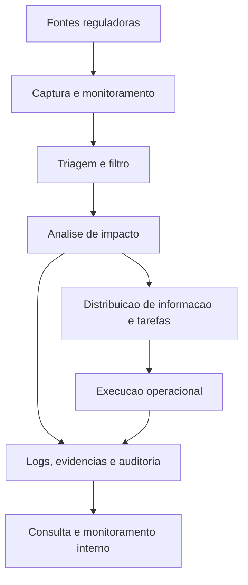

# Mapa mestre do EvertecReg

Este arquivo consolida a leitura principal do projeto e funciona como ponto de partida para orientar decisoes, duvidas e contexto tecnico.

## Resumo executivo

O EvertecReg e a frente de inteligencia regulatoria da suite Compliasset. Ele foi criado para automatizar a captura, triagem, analise e distribuicao de informacoes regulatorias com impacto sobre o negocio e sobre os produtos da Evertec.

O foco nao e apenas consultar normas, mas executar, controlar, registrar e rastrear a resposta operacional ao contexto regulatorio.

## O que o produto resolve

- Captura normativos e informacoes relevantes de orgaos reguladores.
- Filtra o que realmente importa para cada cliente, produto ou area.
- Calcula ou orienta o impacto regulatorio.
- Distribui tarefas e informacoes para ferramentas de execucao como Jira e Teams.
- Mantem trilha de auditoria, evidencias, logs e versionamento.
- Ajuda a reduzir esforço manual e risco operacional.

## Posicao dentro da suite

O Compliasset e a plataforma maior de GRC da Evertec. Dentro dela, o EvertecReg se posiciona como uma camada de inteligencia regulatoria e automacao de analise de impacto.

Isso significa que o produto conversa com:

- agenda regulatoria;
- gestao de compliance e riscos;
- canais de denuncia e privacidade;
- treinamentos;
- gestao de riscos, enquadramento e sanctions screening;
- modulos de operacao e rastreabilidade.

## Eixos funcionais principais

### 1. Produto e negocio

- O sistema e orientado a clientes, modulos e perfis regulados.
- Existe forte dependencia de configuracao por cliente.
- A IA usa documentacao, regras de negocio e contexto da empresa para produzir saidas mais direcionadas.
- O fluxo precisa refletir a diferenca entre consulta, analise, acao e auditoria.

### 2. Operacao regulatoria

- Monitoramento continuo de sites de reguladores.
- Captura de eventos e normativos.
- Analise estruturada de impacto regulatorio.
- Regras para distribuicao de informacoes e tarefas.
- Integracao com ferramentas de comunicacao e execucao.

### 3. Arquitetura e plataforma

- Kafka para eventos e mensageria.
- Redis para cache.
- PostgreSQL como base transacional.
- Vault para secrets e configuracoes.
- Keycloak para autenticacao.
- Kubernetes, Argo CD e KEDA para deploy e escala.
- Prometheus e Loki para observabilidade.
- WAF e App Gateway como barreira de seguranca externa.

### 4. IA e RAG

- Consulta de documentos a partir de fontes como Confluence, Git e arquivos.
- Atualizacao recorrente da base vetorial.
- Motor de IA para analise de impacto, filtro e distribuicao de informacoes.
- Ambiente separado para consultas e validacoes de impacto.

## Fluxo resumido do dominio

## O que mudou com os novos materiais

- O produto ficou mais claramente ligado ao ecossistema Compliasset.
- Os diagramas confirmam uma arquitetura baseada em eventos, cache, secrets e observabilidade.
- O contexto de negocio mostra que o objetivo final e automatizar uma resposta operacional a obrigações regulatorias.
- As telas e fluxos nao sao apenas informativos: eles suportam operacao, rastreio e governanca.

## Dúvidas que ainda valem acompanhamento

- O que entra exatamente no MVP e no pós-MVP.
- Quais integrações ja estao fechadas e quais ainda sao hipoteticas.
- Qual o nivel minimo de detalhes exigido em logs e auditoria.
- Como fica a governanca das fontes por cliente e por area.
- Quais partes da IA dependem de dados do cliente versus conteudo geral.

## Ordem recomendada de leitura

1. [Contexto do Compliasset](contexto_compliasset_evertecreg.md)
2. [Contexto de negocio e origem do produto](contexto_negocio_evertecreg.md)
3. [Resumo dos requisitos e fluxo do produto](resumo_pdfs_evertecreg.md)
4. [Resumo da arquitetura e monitoramento](resumo_arquitetura_evertecreg.md)
5. [Dúvidas e decisões em aberto](duvidas_em_aberto_evertecreg.md)

## Nota de uso

Esse mapa mestre deve ser atualizado sempre que aparecerem novos trechos de contexto, para evitar fragmentacao da leitura do projeto.